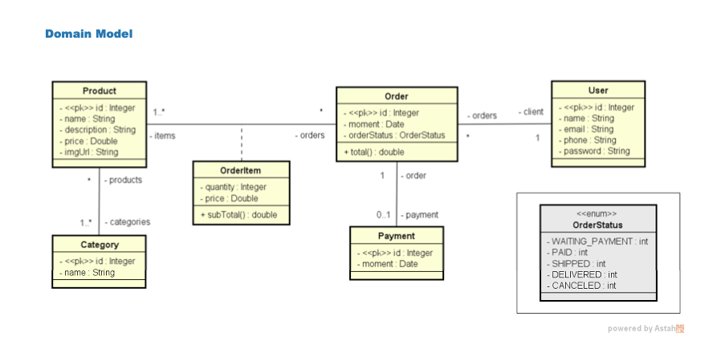
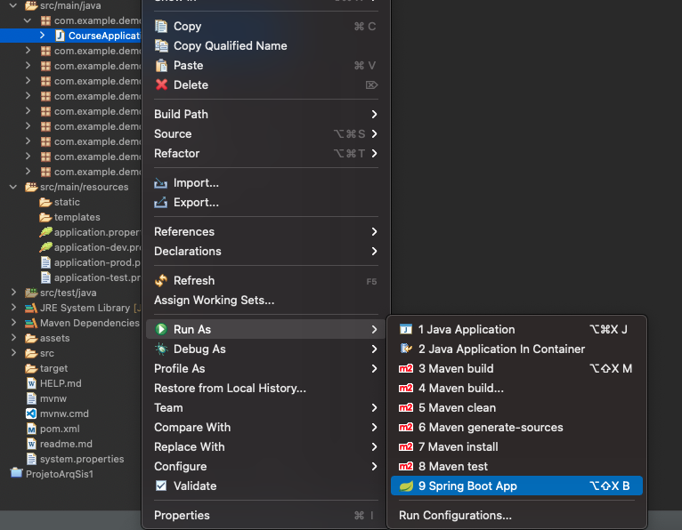
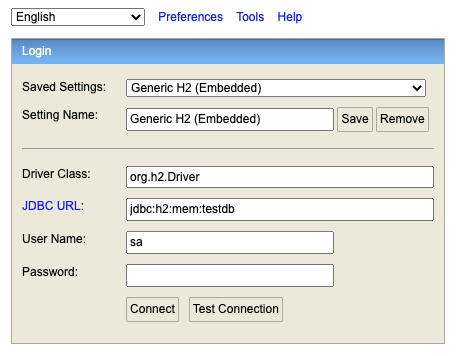

## Project Web Services with Spring Boot and JPA / Hibernate

<hr/>

## About

Simple application about sales backend API using Spring Boot and JPA / Hibernate with H2 as test database and postgres as prod database.

The API have Methods to:

- Create
    - User
    - Category
    - Product
    - Order
- Read
    - User
    - Category
    - Product
    - Order
- Update
    - User
- Delete 
    - User

The aplications was deployed on [Heroku](https://heroku.com/)

<hr/>

## Domain Model:


<hr/>

## Project Download

- Download and installation of [Java](https://www.oracle.com/java/technologies/downloads/)
- Download and installation of [STS - Spring Boot Tools](https://spring.io/tools)
- Download and installation of [Insomnia](https://insomnia.rest/download)
- [Download](https://github.com/franciscocorreia383/Web-Services-With-Spring-Boot-and-JPA-Hibernate/archive/refs/heads/main.zip) this project 

## Usage

- After install the applications, open the STS with workspace in the folder of the project.

- Wait the project load the dependencies.

- Config application proprieties to start project with H2 database.
    
    ```JSON
    spring.profiles.active=test

- Run application as Spring Boot App.

    

- Open [h2-console](http://localhost:8080/h2-console/) to see the tables in H2 database.

    

- Make your tests on TestConfig class.
